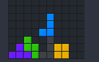
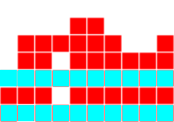
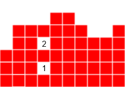

# Report: RL for Tetris

dropdown: 

<details><summary> Dropdown</summary>


</details>

##What is Tetris?


Tetris is a simple grid like game, where the player move different shaped pieces, called <b> tetrominos</b>, with movement and rotation. These pieces in the board will slowly fall down to the screen, in which will eventually stack up together. However, if a row fills up with the pieces, then it will dissapear. The pieces are spawned on the top of the board, descending to the bottom of the board every X second(s), if the piece is spawned on the board and there are no valid moves, i.e. the player cannot move that piece, then the game is over.



## Motivation

Tetris is a competitive game, with players constantly updating how the game is played at all times. Many RL methods like Q-learning could solve the original NES tetris game, which is very old. Current standards of tetris feels and acts differently from the past tetris games, and thus we can consider them different games. Take for example, the scoring, in old tetris your score is equivalent to the lines you clear, thus you only gain a fixed ratio for the total lines you clear, where in the new tetris, you have different scoring methods like the T-spin (where you have to rotate a T-tetromino inbetween at 3 corners while clearing X lines). Thus, my goal is to revive the Tetris AI to a much newer standard of playing, and hopefully can learn the newer skills in modern tetris that old tetris never considers. 

## Standardization of Tetris

As a game that has been around for almost 40 years, there has been multiple versions of the game that alter the rules of Tetris. Therefore, a standardized rule/guideline was made in the early 2000s to generalize the Tetris game. Each rule/game mechanic will be explained further in detail in the implementation..

In our version, we chose to implement most of the ruleset, while leaving out some, the included rules and gameplay are included as follows (✅ Included, ❌ Ignored/Removed/Not Implemented)
(Note: Although there are strict definitions for certain rules, those are not includeded i.e. where the tetrominos start)

* ✅ A 10x20 Board with all 7 Default Tetrominos (I, O, T, S, Z, J, L)

* ✅ Implements the SRS (Super Rotation System)

* ✅ Standard Controls (Rotate Left, Rotate Right, Move Left, Move Right, Move Down)

* ❌ Hard Drop (instant dropping a tetromino)

* ✅ Tetromino Randomizer (7-Bag system) -> Spawning the tetromino piece

* ❌ "Hold Piece": can choose to hold a piece until swapped out with another piece to replace in the play boad

* ❌ "Future Pieces": you can see the future pieces (after) your current piece

* ✅ "Ghost Piece" (Disabled in training) -> shows where the piece will land

* ✅ T-Spins: by rotating a t-piece in a specific location (with 3 corners)

* ✅ Lock delay: if you land a piece, there is some time (half a second) to move/rotate a piece

* ✅ Combos: by clearing lines consecutively, you are able to gain more subsquent combos that will earn more points

* ✅ Back to back: by accomplishing a "difficult" move, you earn more points (Examples of difficult moves: T-spins, Tetris (4 lines cleared at once), Perfect Clear)

* ✅ Perfect Clear: if you clear the entire board you are able to earn more points

References
[1] Rules and Guidelines: https://tetris.fandom.com/wiki/Tetris_Guideline

## Tetris Environment Implementation

In our project, the game is implemented in Unity and C#. However, the logic still remains the same for the pseudocode. The environment takes one value (the action) and returns three values: the rewards given the reward schedule, the observation from the environment.
```
def logic():
    while(true):
        reward, obs = env(action)
```
Naively, we can assume that our observation is the screen space, which is just a vector space of the board. If there is a piece at that location it would be 1 and 0 if none. 

The reward schedule is variant, and there are multiple reasons to include different reward schedules.

Here is the current reward schedule:

- (penalty) -5 points for losing
- for each block that lands 0.005 * multiplier, where multiplier = how low/high a block is 
- scoring squared (clearing lines, t-spin, etc), which are normal scoring methods in traditional tetris, but the results are squared

Our reward schedule wants to incentivise the AI to continue placing blocks as low as possible, while penalizing them for losing. To keep true to tetris scoring, we have that as a reward schedule, this potentially should yield higher returns when a score is made with that metric. Furthermore, by scoring more lines, since the results are squared, the higher rewards should be present.

### Game Board and Tetrominos

```

```
## Optimization

When you consider a human playing tetris, an observation at the specific cells would not yield as high results than looking at the possibility of the next placed piece in some location. Thus, we can further optimize the observation, from looking at the screen, we should look at the next potential moves that we could make, and from that derive a metric to look at those observations.

Assuming that a board is static for a single observation, if we drop a piece in every position as well as for every rotation, we can observe the results from that drop. How should we observe that result? Here are 4 heuristics to consider: the aggregate height, any complete lines, all holes, and the bumpiness.

- <b>Aggregate Height</b>: this value represents the sum of all the heights in the board, if we consider a high board (which has higher pieces), this value will generally be greater. Thus, the AI's goal should be to minimize this value.

 

- <b>Complete Lines</b>: this represents the total amount of lines that would be cleared. This value should be maximized for greater rewards.

 

- <b>Bumpiness</b>: if we compare every column next to each other, some taller columns risks the structure being much taller than what it should be. Given that, the bumpiness is the difference between each column amount summed. 

 

- <b>Holes</b>: if we play enough tetris, we know that holes can be a nightmare, since they prevent lines from being cleared at an optimal pace, as well as poised to leading to a game over. Therefore, if we have the option to we want to have the minimum amount of holes.

 

### Adaptation

Thus, for each current tetris piece, we look at each x position (from 0 to 10) and every rotation for that piece (4 rotations). Then calculate the heuristics for each, which results with 4 * 4 * 10 = 160 total observations for the possible choices. +1 for an observation of the current tetromino. 

References
[1] Four Heurisitics for Tetris: https://codemyroad.wordpress.com/2013/04/14/tetris-ai-the-near-perfect-player/

## Models

### Model Overview

### Proximal Policy Optimization (PPO)

There are many different models and architectures to consider with how advanced RL methods have come. For our game, we prefer an architecture that can avoid large policy updates, which is what PPO excels at.

Proximal Policy Optimization, or PPO, is a policy gradient method for RL that optimizes a "surrogate" objective function.

- When we have a policy update that takes a step in the wrong direction, which we consider a bad policy, it can be hard to recover from that loss. Thus, we want to alleviate this problem by updating the policy liberally. We get these values by calculating the ratio between the last policy and the current policy, and result in a range [1 - epsilon, 1 + epsilon], this is the <b>Proximal Policy</b>.

- ratio:

    $${\pi_\theta(a_t|s_t) \over \pi_{\theta_{old}}(a_t|s_t)}$$
    
    - divergence between old and current policy 

        - if ratio > 1 : action and state = current policy
        - if 0 < ratio < 1 : action and state = old policy

- Previous Policy Objective Function: L = E[ log pi(a|s) * A ], by doing a gradient ascent our agents should take actions that lead to higher rewards

    - Problems: 

- Surrogate Objective Function: 
$$ L^{CLIP}(\theta)=\hat {\mathbb{E}}_t \left [ \min(r_t(\theta) \hat A_t, \text{clip}(r_t(\theta), 1-\epsilon, 1+\epsilon)\hat A_t) \right ] $$

    - Clipping *clip* in the objective function, to prevent large policy updates

```
# Here is a pseudocode example of the policy update
# policy update
def policy_update(self, model):
    # evaluate the policy
    pi = policy.evaluate()

    # find the ratio
    ratio = pi / pi_old

    # surrogate loss
    loss = min(ratio * advantage, clip(ratio, 1 - eps, 1 + eps) * advantage)

    # update gradients
    update_gradients()

```

References
[1] PPO paper https://arxiv.org/pdf/1707.06347v2.pdf

### Imitation Learning

#### Behavior Cloning (BC)

- Collects demonstrations from an expert
- Batch the data into S/A pairs (S, A)
- Learn the policy by minimizing the loss function

### Inverse Reinforcement Learning

Inverse Reinforcement Learning: learning an agent's objective, value and rewards.

#### Generative Adversarial Imitation Learning (GAIL)

A model free imitation learning algorithm, inspired by GANS.

- Train generators to have the behaviors and patterns of the data (expert player)
- Discriminator -> reward function. Judge if the behaviors from the generator look like the expert player
- Basically generators fool the discriminators to try and be the expert player

## Results

## Discussion

## Version

This project uses Unity (2021.3 or later) and Python (3.8.13 or higher)

## Instructions

Creating a virtual environment with the project (to run MLagents)

1. cd to the game directory (i.e. Windows: C:\Users\ ...\ ...\MLAgents-Modern-Tetris)

2. setup a directory \<dir-name> as the directory and location of a new virtual environment
- python -m \<dir-name> venv

3. cd to the directory and activate the virtual environment
- cd \<dir-name>\Scripts -> activate

3. upgrade pip (for venv)
- python -m pip install --upgrade pip

4. install pytorch (for venv)
- pip3 install torch~=1.7.1 -f https://download.pytorch.org/whl/torch_stable.html

5. install mlagents (for venv)
- python -m pip install mlagents==0.30.0

## MlAgents Misc

To view a description of all the CLI options accepted by mlagents-learn, use the --help:
mlagents-learn --help

The basic command for training is:
mlagents-learn \<trainer-config-file> --env=<env_name> --run-id=\<run-identifier>
i.e.) mlagents-learn config/agent-config.yaml --run-id TetrisPPO --force