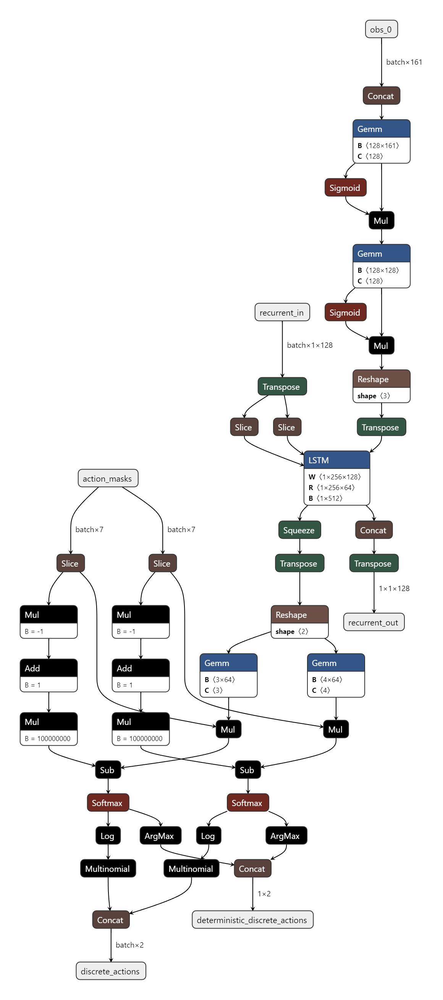
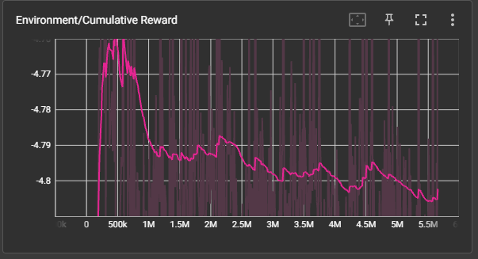
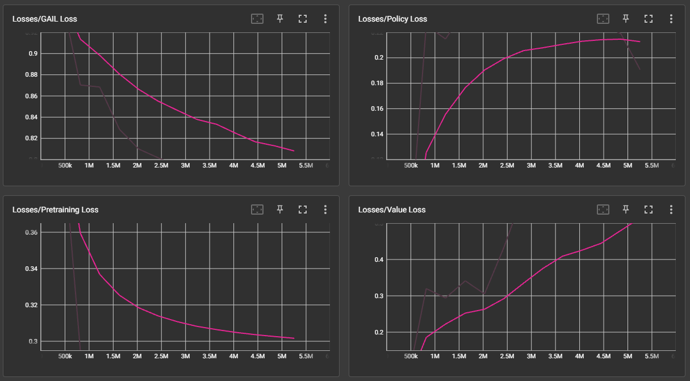
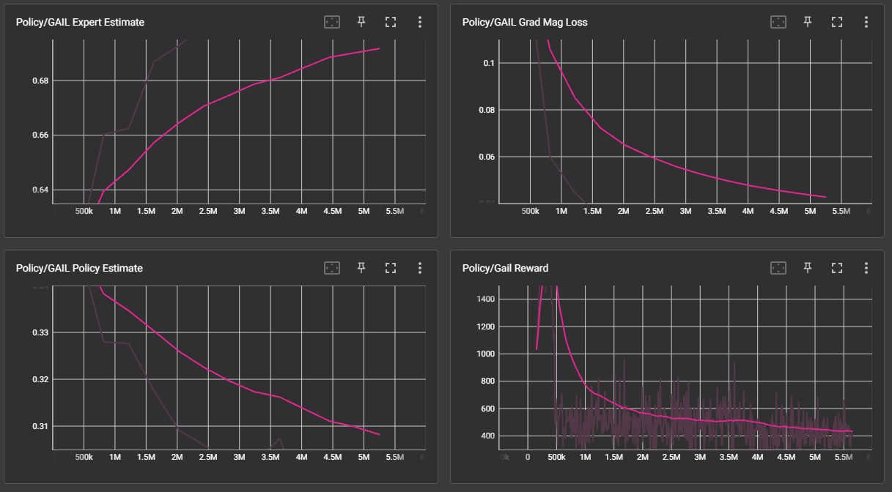
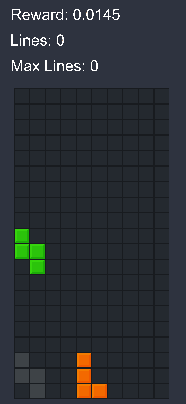

# Report: RL for Tetris

##What is Tetris?

Tetris is a simple grid like game, where the player move different shaped pieces, called <b> tetrominos</b>, with movement and rotation. These pieces in the board will slowly fall down to the screen, in which will eventually stack up together. However, if a row fills up with the pieces, then it will dissapear. The pieces are spawned on the top of the board, descending to the bottom of the board every X second(s), if the piece is spawned on the board and there are no valid moves, i.e. the player cannot move that piece, then the game is over.


## Motivation

Tetris is a competitive game, with players constantly updating how the game is played at all times. Many RL methods like Q-learning could solve the original NES tetris game, which is very old. Current standards of tetris feels and acts differently from the past tetris games, and thus we can consider them different games. Take for example, the scoring, in old tetris your score is equivalent to the lines you clear, thus you only gain a fixed ratio for the total lines you clear, where in the new tetris, you have different scoring methods like the T-spin (where you have to rotate a T-tetromino inbetween at 3 corners while clearing X lines). Thus, my goal is to revive the Tetris AI to a much newer standard of playing, and hopefully can learn the newer skills in modern tetris that old tetris never considers. 

### Why Machine Learning?

We can first confirm that tetris is a problem that is NP complete, we can easily look at if there is a solution for a piece in some kind of board. However, we intend to maximize the amount of scores that we can achieve, this means that there are multiple combinations that require many different pieces in some kind of order to achieve that.

We can prove that this problem is NP-hard by reducing it from another problem: 3-Partition. The proof is given under the resources [1]. With this proof we know that the game is deterministic. However, still with many variables to consider, as well as the many possibilities to play the game, a large state space, and what problems we could solve before moving onto larger ones. With that many considerations, we can look to reinforcement learning in order to solve this problem.

Note that this project is really hard to work on in Colab or Jupyter notebook due to the fact that it has a limited runtime, whereas hard RL problems need a lot of time to train.

Resources:
[1] https://erikdemaine.org/papers/Tetris_TR2002/paper.pdf

## Standardization of Tetris

As a game that has been around for almost 40 years, there has been multiple versions of the game that alter the rules of Tetris. Therefore, a standardized rule/guideline was made in the early 2000s to generalize the Tetris game. Each rule/game mechanic will be explained further in detail in the implementation..

In our version, we chose to implement most of the ruleset, while leaving out some, the included rules and gameplay are included as follows (✅ Included, ❌ Ignored/Removed/Not Implemented)
(Note: Although there are strict definitions for certain rules, those are not includeded i.e. where the tetrominos start)

* ✅ A 10x20 Board with all 7 Default Tetrominos (I, O, T, S, Z, J, L)

* ✅ Implements the SRS (Super Rotation System)

* ✅ Standard Controls (Rotate Left, Rotate Right, Move Left, Move Right, Move Down)

* ❌ Hard Drop (instant dropping a tetromino)

* ✅ Tetromino Randomizer (7-Bag system) -> Spawning the tetromino piece

* ❌ "Hold Piece": can choose to hold a piece until swapped out with another piece to replace in the play boad

* ❌ "Future Pieces": you can see the future pieces (after) your current piece

* ✅ "Ghost Piece" (Disabled in training) -> shows where the piece will land

* ✅ T-Spins: by rotating a t-piece in a specific location (with 3 corners)

* ✅ Lock delay: if you land a piece, there is some time (half a second) to move/rotate a piece

* ✅ Combos: by clearing lines consecutively, you are able to gain more subsquent combos that will earn more points

* ✅ Back to back: by accomplishing a "difficult" move, you earn more points (Examples of difficult moves: T-spins, Tetris (4 lines cleared at once), Perfect Clear)

* ✅ Perfect Clear: if you clear the entire board you are able to earn more points

References
[1] Rules and Guidelines: https://tetris.fandom.com/wiki/Tetris_Guideline

## Tetris Environment Implementation

In our project, the game is implemented in Unity and C#. However, the logic still remains the same for the pseudocode. The environment takes one value (the action) and returns three values: the rewards given the reward schedule, the observation from the environment.
```
def logic():
    while(true):
        reward, obs = env(action)
        
        # AI operations
```
Naively, we can assume that our observation is the screen space, which is just a vector space of the board. If there is a piece at that location it would be 1 and 0 if none. 

The reward schedule is variant, and there are multiple reasons to include different reward schedules.

Here is the current reward schedule:

- (penalty) -5 points for losing
- for each block that lands 0.005 * multiplier, where multiplier = how low/high a block is 
- scoring squared (clearing lines, t-spin, etc), which are normal scoring methods in traditional tetris, but the results are squared

Our reward schedule wants to incentivise the AI to continue placing blocks as low as possible, while penalizing them for losing. To keep true to tetris scoring, we have that as a reward schedule, this potentially should yield higher returns when a score is made with that metric. Furthermore, by scoring more lines, since the results are squared, the higher rewards should be present.

### Game Board and Tetrominos

```

```
## Optimization

When you consider a human playing tetris, an observation at the specific cells would not yield as high results than looking at the possibility of the next placed piece in some location. Thus, we can further optimize the observation, from looking at the screen, we should look at the next potential moves that we could make, and from that derive a metric to look at those observations.

Assuming that a board is static for a single observation, if we drop a piece in every position as well as for every rotation, we can observe the results from that drop. How should we observe that result? Here are 4 heuristics to consider: the aggregate height, any complete lines, all holes, and the bumpiness.

- <b>Aggregate Height</b>: this value represents the sum of all the heights in the board, if we consider a high board (which has higher pieces), this value will generally be greater. Thus, the AI's goal should be to minimize this value.

 

- <b>Complete Lines</b>: this represents the total amount of lines that would be cleared. This value should be maximized for greater rewards.

 

- <b>Bumpiness</b>: if we compare every column next to each other, some taller columns risks the structure being much taller than what it should be. Given that, the bumpiness is the difference between each column amount summed. 

 

- <b>Holes</b>: if we play enough tetris, we know that holes can be a nightmare, since they prevent lines from being cleared at an optimal pace, as well as poised to leading to a game over. Therefore, if we have the option to we want to have the minimum amount of holes.

 

### Adaptation

Thus, for each current tetris piece, we look at each x position (from 0 to 10) and every rotation for that piece (4 rotations). Then calculate the heuristics for each, which results with 4 * 4 * 10 = 160 total observations for the possible choices. +1 for an observation of the current tetromino. 

References
[1] Four Heurisitics for Tetris: https://codemyroad.wordpress.com/2013/04/14/tetris-ai-the-near-perfect-player/

## Models

### Model Overview

 

- Model: Recurrent with 128 hidden units and 2 layers

### Proximal Policy Optimization (PPO)

There are many different models and architectures to consider with how advanced RL methods have come. For our game, we prefer an architecture that can avoid large policy updates, which is what PPO excels at.

Proximal Policy Optimization, or PPO, is a policy gradient method for RL that optimizes a "surrogate" objective function.

- When we have a policy update that takes a step in the wrong direction, which we consider a bad policy, it can be hard to recover from that loss. Thus, we want to alleviate this problem by updating the policy liberally. We get these values by calculating the ratio between the last policy and the current policy, and result in a range [1 - epsilon, 1 + epsilon], this is the <b>Proximal Policy</b>.

- Ratio:

    $${\pi_\theta(a_t|s_t) \over \pi_{\theta_{old}}(a_t|s_t)}$$
    
    - divergence between old and current policy 

        - if ratio > 1 : action and state = current policy
        - if 0 < ratio < 1 : action and state = old policy

- Previous Policy Objective Function (REINFORCE): 
    $$L = \hat {\mathbb{E}}_t [log\pi(a|s) * \hat A_t]$$

By doing a gradient ascent our agents should take actions that lead to higher rewards. However, since we have this idea of clipping, we adapt it to the policy update.

- Surrogate Objective Function: 

    $$L^{CLIP}(\theta)=\hat {\mathbb{E}}_t \left [ \min(r_t(\theta) \hat A_t, \text{clip}(r_t(\theta), 1-\epsilon, 1+\epsilon)\hat A_t) \right ]$$

    - Clipping *clip* in the objective function, to prevent large policy updates

```
# Here is a pseudocode example of the policy update
# policy update
def policy_update(self, model):
    # evaluate the policy
    pi = policy.evaluate()

    # find the ratio
    ratio = pi / pi_old

    # surrogate loss
    loss = min(ratio * advantage, clip(ratio, 1 - eps, 1 + eps) * advantage)

    # update gradients
    update_gradients()

```

References
[1] PPO paper https://arxiv.org/pdf/1707.06347v2.pdf

### Inverse Reinforcement Learning

Reinforcement learning takes an environment and rewards to give us an action for the agent to effect the environment. However, we can think of the opposite, the inverse as such (inverse reinforcement learning). This takes the agent's objective and attempts to predict the object, value and rewards from the agent. From this we can use data in order to help train our reinforcement learning model. 

#### Generative Adversarial Imitation Learning (GAIL)

Modern tetris is being played frequently by players, and with the amount of difficult decisions that we make when playing modern tetris we could use help from demonstrations to learn a correct way to play tetris. Thus, we look at GAIL, a method that utilizes Generative Adversarial Networks in order to learn a more effective way to play tetris. 

GAIL is model free, and thus looks at actions from human demonstrations and derive a reward from the descriminator. Then the generator, which is PPO in our case, creates a policy.

We can utilize the expert opinion from a player "me" in order to train our AI with a better idea of how the game should be played. When you should consider dropping a piece when it is 1 height or if it is 4 heights for maximizing the points. 

The data from GAIL is recorded from me in a 1 hour playthrough of tetris in the environment. It is recorded as TetrisDemo.demo. I have achieved over 100 rewards in the playthrough, thus I consider myself an expert player in that demonstration.

References:
[1] https://arxiv.org/pdf/1606.03476.pdf

## Results

https://www.youtube.com/watch?v=-Cb9MtgNxUg

This model has been training for 5 million epochs, and for around 4 hours with 32 agents training at the same time. 
Here are the hyperparameters for the first model:

PPO:
- <b>Batch Size </b> (batches used for experience replay): 512
- <b>Buffer Size </b> (the size of the list containing all of the experience replay buffer): 409600
- <b>Learning Rate </b> (learning rate of the model, corresponds to the gradient descent in every step): 0.001
- <b>Beta </b> (entropy regularization -> ensures that the agent exploits more): 0.01
- <b>Epsilon </b> (threshold of divergence between policies): 0.3
- <b>Lambda </b> (used for Generalized Advantage Estimate): 0.95
- <b>Num Epoch </b> (the total amount of epochs passed to the experience replay buffer): 5
- <b>Sequence length </b> (the amount of epochs passed to the replay buffer) for a recurrent network: 64

GAIL:
- <b>Expert Data </b>: 60 minutes of gameplay
- <b>Strength </b>: (reward multiplier, but in short the % of us comparing the agent to our expert player as the expert player for the discriminator) 0.5
- <b>Gamma </b>: (discount factor) 0.99

Both models, PPO and GAIL, contains 2 layers with 128 hidden units per layer.

 
 
 

 

## Discussion

As you can see the results are bad, somehow after 500,000 iterations, there is a steep decline in the cumulative reward. What could be causing this?

- If we examine the data, we can tell the the model slowly over time loses more average reward and is steadily declining over 5.5 million epochs. The GAIL loss decreases, while the model loss increases, which is opposite of what we want. Furthermore, another good data point to examine is the GAIL expert estimate, if there is a higher GAIL expert estimate, than it predicts the right expert player more frequently, which is in this case increasing, and not what we want.

- A more defined reward schedule: perhaps the penalty is too much, the agent could have learned to just not take that penalty, and instead "stall for time", which is take unnecessary actions to not lose the cumuluative reward over time. The agent could also know that the trade off for the reward is more if you continuously stack pieces than steadily place it in the right direction and placing the piece at that location.

- We can even consider taking a longer time to train our model. Most RL models take more than just 5 million epochs, or just more than 1 day itself to be an effective model. However, given the time constraint and how hard the problem is compared to the easier RL problems like lunar lander or cartpole, this model can take up to many days to even learn something effective. Even some simple Atari games struggle to learn effectively until over half a day of training.

- We might not even consider that at 500k iterations it is slowly not improving, perhaps we need to make the model train much much more slower, so that it can learn to explore more often. In this case, it is slowly declining since we might believe that the model will learn much faster, and will exploit as fast as possible. However, from the results we can tell that the agent did not learn much from taking these actions.

- From the NN at the end, it is taking a lot of unnecessary actions and thus takes a long time to lock the tetrominos in place. Thus perhaps, we can introduce a penalty for the amount of actions that a piece can take? This can be helpful or very dangerous. We have the side of the pieces not wanting to be rotated and then leading to no exploration for turning pieces since the agent might learn to avoid doing that. Furthermore, on the other end this can solve the issue of the network taking actions as much as possible.

- The last improvement that I could make is to give it more expert data, but since it is not learning much from the small data that it already recives, it seems like it will not improve the model by much if it starts training. If we look at the expert estimate for the discriminator, we can easily say that the discriminator is effectively predicting the expert player, as the generator is not performing that well. This aligns with our data and expectations, which should mean that this data is generally not the issue.

- Here is another issue to consider with the model as well, what if we assume that the model is learning effectively? Then we can also add onto the fact that the model might lose more reward over time, because they are exploring more effectively by dropping the pieces more, which should lead to them losing more rewards over time since it gets penalized when the game loses. This could mean that given more time the agent would be able to learn effectively, but not now.

## Second Try

I ran the model a second time with some parameters changed in order to see how the model can perform in a different setting. This time


## Conclusions

As one of the projects that did not actually solve the problem, especially in reinforcement learning, there is a lot to reflect from and possibly from the data, predict what could have gone wrong with the model. 

## Version

This project uses Unity (2021.3 or later) and Python (3.8.13 or higher)

## Instructions

Creating a virtual environment with the project (to run MLagents)

1. cd to the game directory (i.e. Windows: C:\Users\ ...\ ...\MLAgents-Modern-Tetris)

2. setup a directory \<dir-name> as the directory and location of a new virtual environment
- python -m \<dir-name> venv

3. cd to the directory and activate the virtual environment
- cd \<dir-name>\Scripts -> activate

3. upgrade pip (for venv)
- python -m pip install --upgrade pip

4. install pytorch (for venv)
- pip3 install torch~=1.7.1 -f https://download.pytorch.org/whl/torch_stable.html

5. install mlagents (for venv)
- python -m pip install mlagents==0.30.0

## MlAgents Misc

To view a description of all the CLI options accepted by mlagents-learn, use the --help:
mlagents-learn --help

The basic command for training is:
mlagents-learn \<trainer-config-file> --env=<env_name> --run-id=\<run-identifier>
i.e.) mlagents-learn config/agent-config.yaml --run-id TetrisPPO --force